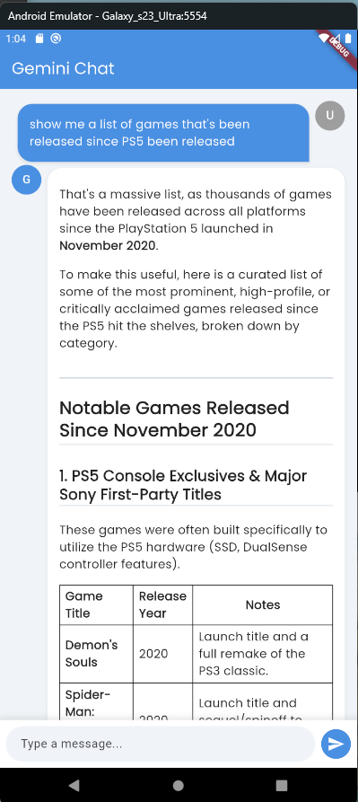
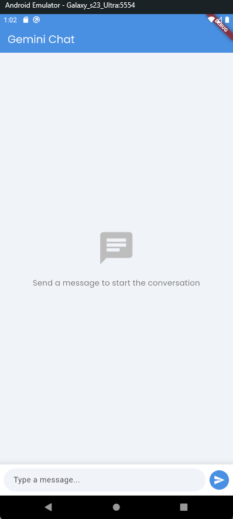

# Gemini API Chat App

A simple chat application built with Flutter that uses the Gemini API.

## Screenshots

| Chat Page | Empty Chat |
| :---: | :---: |
|  |  |

## Features

*   **Real-time chat:** Chat with the Gemini AI in real-time.
*   **Markdown support:** Gemini's responses are rendered with markdown support.
*   **Modern UI:** A clean and user-friendly interface with chat bubbles, avatars, and a responsive layout.
*   **Auto-scrolling:** The chat automatically scrolls to the latest message.
*   **Expandable text field:** The text input field expands as you type.

## Packages Used

| Package | Version |
| --- | --- |
| [cupertino_icons](https://pub.dev/packages/cupertino_icons) | ^1.0.8 |
| [flutter_gemini](https://pub.dev/packages/flutter_gemini) | ^3.0.0 |
| [google_fonts](https://pub.dev/packages/google_fonts) | ^6.3.2 |
| [provider](https://pub.dev/packages/provider) | ^6.1.5+1 |
| [equatable](https://pub.dev/packages/equatable) | ^2.0.7 |
| [flutter_dotenv](https://pub.dev/packages/flutter_dotenv) | ^6.0.0 |
| [markdown_widget](https://pub.dev/packages/markdown_widget) | ^2.3.2+8 |

## File Structure

```
lib
├───main.dart
└───src
    ├───core
    └───features
        └───chat
            ├───data
            │   ├───datasources
            │   └───repositories
            ├───domain
            │   ├───entities
            │   └───repositories
            └───presentation
                ├───manager
                ├───pages
                └───widgets
```

## Getting Started

To get a local copy up and running follow these simple steps.

### Prerequisites

*   Flutter SDK: [https://flutter.dev/docs/get-started/install](https://flutter.dev/docs/get-started/install)
*   A Gemini API key.

### Installation

1.  Clone the repo
    ```sh
    git clone https://github.com/your_username_/gemini_api_app.git
    ```
2.  Install Flutter packages
    ```sh
    flutter pub get
    ```
3.  Create a `.env` file in the root of the project and add your Gemini API key:
    ```
    GEMINI_API_KEY=YOUR_API_KEY
    ```
4.  Run the app
    ```sh
    flutter run
    ```

## Contributing

Contributions are what make the open source community such an amazing place to learn, inspire, and create. Any contributions you make are **greatly appreciated**.

If you have a suggestion that would make this better, please fork the repo and create a pull request. You can also simply open an issue with the tag "enhancement".

1.  Fork the Project
2.  Create your Feature Branch (`git checkout -b feature/AmazingFeature`)
3.  Commit your Changes (`git commit -m 'Add some AmazingFeature'`)
4.  Push to the Branch (`git push origin feature/AmazingFeature`)
5.  Open a Pull Request
